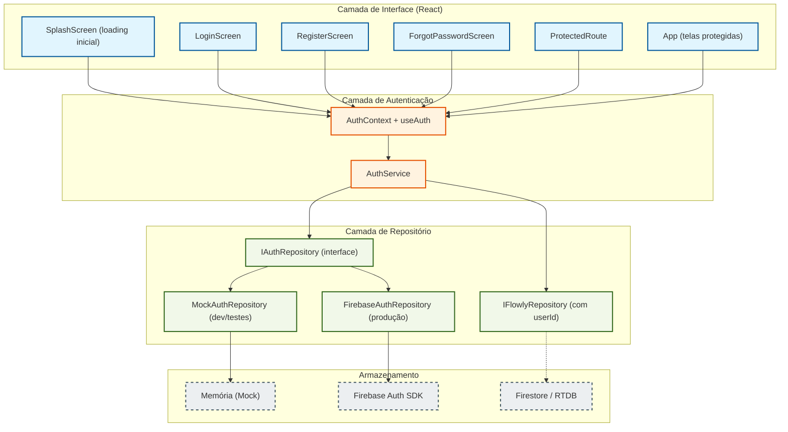

# Documento de Design Técnico — Flowly Auth

## Visão Geral

O módulo `flowly-auth` adiciona autenticação ao Flowly mantendo os mesmos princípios arquiteturais já estabelecidos: Repository Pattern, injeção de dependência via React Context e separação estrita entre lógica de negócio e interface.

O design segue três objetivos centrais:

1. **Desacoplamento do provedor**: a lógica de autenticação nunca referencia Firebase, Auth0 ou qualquer SDK diretamente — apenas a interface `IAuthRepository`.
2. **Isolamento de dados por usuário**: o `userId` da sessão ativa é propagado para todas as operações do `IFlowlyRepository`, garantindo privacidade total.
3. **Compatibilidade com React Native**: toda a lógica de autenticação reside em camadas sem dependência de APIs de browser, facilitando a migração futura.

A implementação de produção usa **Firebase Authentication**, que suporta email/senha, Google OAuth e Apple Sign-In nativamente, além de persistência de sessão e renovação automática de token.

---

## Arquitetura

### Diagrama de Camadas



### Fluxo de Autenticação

```
Abertura do App
    → AuthContext inicializa
        → AuthService.obterSessaoAtual()
            → IAuthRepository.obterSessaoAtual()
        → [sessão válida] → renderiza App protegido
        → [sem sessão]    → renderiza LoginScreen
        → [verificando]   → renderiza SplashScreen

Login com Email
    → LoginScreen coleta email + senha
    → AuthService.loginComEmail(email, senha)
        → IAuthRepository.loginComEmail(email, senha)
        → retorna UserProfile + token
    → AuthContext atualiza estado → ProtectedRoute libera acesso

Login Social (Google / Apple)
    → AuthService.loginComGoogle() / loginComApple()
        → IAuthRepository.loginComGoogle() / loginComApple()
        → provedor confirma identidade
        → cria ou recupera conta Flowly
    → AuthContext atualiza estado

Logout
    → AuthService.logout()
        → IAuthRepository.logout()
        → remove dados locais de sessão
    → AuthContext limpa estado → ProtectedRoute redireciona para login
```

### Decisões de Arquitetura

| Decisão | Escolha | Justificativa |
|---|---|---|
| Provedor de autenticação | Firebase Authentication | Suporte nativo a email/senha, Google, Apple; persistência automática de sessão; renovação de token transparente |
| Abstração | IAuthRepository | Permite trocar Firebase por Auth0 ou outro provedor sem alterar AuthService ou UI |
| Estado de auth | React Context + useReducer | Consistente com o padrão já adotado no RepositoryContext |
| Isolamento de dados | userId propagado para IFlowlyRepository | Cada operação de leitura/escrita filtra pelo userId da sessão ativa |
| Mock para testes | MockAuthRepository | Simula todos os fluxos sem chamadas de rede; compatível com Vitest |
| Tela de loading | SplashScreen dedicada | Evita flash de tela de login antes de verificar sessão persistida |

---

## Componentes e Interfaces

### IAuthRepository

```typescript
// src/auth/IAuthRepository.ts

export interface UserProfile {
  id: string;           // UID único do provedor
  nome: string;         // Nome de exibição
  email: string;        // Email do usuário
  fotoPerfil?: string;  // URL da foto (provedores sociais)
}

export interface Sessao {
  usuario: UserProfile;
  token: string;
  expiresAt: number;    // Unix timestamp de expiração
}

export type AuthResult =
  | { sucesso: true; sessao: Sessao }
  | { sucesso: false; erro: string };

export interface IAuthRepository {
  loginComEmail(email: string, senha: string): Promise<AuthResult>;
  registrarComEmail(nome: string, email: string, senha: string): Promise<AuthResult>;
  loginComGoogle(): Promise<AuthResult>;
  loginComApple(): Promise<AuthResult>;
  logout(): Promise<void>;
  recuperarSenha(email: string): Promise<void>;
  obterSessaoAtual(): Promise<Sessao | null>;
  renovarToken(): Promise<Sessao | null>;
}
```

### AuthService

```typescript
// src/auth/AuthService.ts

export class AuthService {
  constructor(private readonly repo: IAuthRepository) {}

  async loginComEmail(email: string, senha: string): Promise<AuthResult>;
  async registrarComEmail(nome: string, email: string, senha: string): Promise<AuthResult>;
  async loginComGoogle(): Promise<AuthResult>;
  async loginComApple(): Promise<AuthResult>;
  async logout(): Promise<void>;
  async recuperarSenha(email: string): Promise<void>;
  async obterSessaoAtual(): Promise<Sessao | null>;
  async renovarToken(): Promise<Sessao | null>;
}
```

O `AuthService` contém a lógica de negócio (validações de formato, mensagens de erro padronizadas, propagação do `userId` para o repositório de dados) e delega todas as operações de rede/storage para `IAuthRepository`.

### AuthContext e useAuth

```typescript
// src/auth/AuthContext.tsx

export interface AuthState {
  usuario: UserProfile | null;
  sessao: Sessao | null;
  carregando: boolean;   // true durante verificação inicial de sessão
  erro: string | null;
}

export interface AuthContextValue extends AuthState {
  loginComEmail(email: string, senha: string): Promise<void>;
  registrarComEmail(nome: string, email: string, senha: string): Promise<void>;
  loginComGoogle(): Promise<void>;
  loginComApple(): Promise<void>;
  logout(): Promise<void>;
  recuperarSenha(email: string): Promise<void>;
}

// Hook de consumo
export function useAuth(): AuthContextValue;
```

### ProtectedRoute

```typescript
// src/auth/ProtectedRoute.tsx

interface ProtectedRouteProps {
  children: ReactNode;
}

// Renderiza children se há sessão ativa.
// Renderiza SplashScreen se carregando === true.
// Redireciona para LoginScreen se não há sessão.
export function ProtectedRoute({ children }: ProtectedRouteProps): JSX.Element;
```

### Telas de Autenticação

```typescript
// src/screens/auth/LoginScreen.tsx
// src/screens/auth/RegisterScreen.tsx
// src/screens/auth/ForgotPasswordScreen.tsx
// src/screens/auth/SplashScreen.tsx
```

Cada tela consome apenas `useAuth()` — sem conhecimento direto do `AuthService` ou `IAuthRepository`.

### Estrutura de Arquivos

```
src/
├── auth/
│   ├── IAuthRepository.ts          # Interface + tipos (UserProfile, Sessao, AuthResult)
│   ├── AuthService.ts              # Lógica de negócio de autenticação
│   ├── AuthContext.tsx             # Context + Provider + useAuth hook
│   ├── ProtectedRoute.tsx          # Guard de rota
│   ├── MockAuthRepository.ts       # Implementação mock para dev/testes
│   └── FirebaseAuthRepository.ts   # Implementação Firebase (produção)
├── screens/
│   └── auth/
│       ├── LoginScreen.tsx
│       ├── RegisterScreen.tsx
│       ├── ForgotPasswordScreen.tsx
│       └── SplashScreen.tsx
└── repository/
    ├── IFlowlyRepository.ts        # Atualizado: métodos recebem userId
    └── MockFlowlyRepository.ts     # Atualizado: filtra por userId
```

### Integração com IFlowlyRepository

O `IFlowlyRepository` será atualizado para receber `userId` em todas as operações, garantindo isolamento de dados:

```typescript
interface IFlowlyRepository {
  listarTransacoes(userId: string, filtros?: TransactionFilter): Promise<Transaction[]>;
  adicionarTransacao(userId: string, transacao: Omit<Transaction, 'id'>): Promise<Transaction>;
  atualizarTransacao(userId: string, id: string, dados: Partial<Transaction>): Promise<Transaction>;
  removerTransacao(userId: string, id: string): Promise<void>;
  listarCarteiras(userId: string): Promise<Wallet[]>;
  adicionarCarteira(userId: string, nome: string): Promise<Wallet>;
  obterSaldoPorCarteira(userId: string, nomeCarteira: string): Promise<number>;
}
```

O `useFlowly` hook obtém o `userId` via `useAuth()` e o propaga automaticamente para todas as chamadas do repositório.

---

## Modelos de Dados

### UserProfile

```typescript
interface UserProfile {
  id: string;          // UID único e imutável do provedor (ex: Firebase UID)
  nome: string;        // Nome de exibição (não vazio)
  email: string;       // Email válido
  fotoPerfil?: string; // URL opcional (provedores sociais)
}
```

### Sessao

```typescript
interface Sessao {
  usuario: UserProfile;
  token: string;       // JWT ou token opaco do provedor
  expiresAt: number;   // Unix timestamp (ms) de expiração do token
}
```

### AuthResult

```typescript
type AuthResult =
  | { sucesso: true; sessao: Sessao }
  | { sucesso: false; erro: string };
```

### AuthState (estado do Context)

```typescript
interface AuthState {
  usuario: UserProfile | null;  // null = não autenticado
  sessao: Sessao | null;
  carregando: boolean;          // true apenas durante verificação inicial
  erro: string | null;
}
```

### Regras de Validação de Autenticação

| Campo | Regra |
|---|---|
| `email` | Formato válido: contém `@` e domínio com `.` |
| `senha` | Mínimo 8 caracteres |
| `nome` | String não vazia após trim |
| `UserProfile.id` | String não vazia, imutável após criação |
| `Sessao.expiresAt` | Timestamp futuro no momento da criação |

---

## Propriedades de Correctness

*Uma propriedade é uma característica ou comportamento que deve ser verdadeiro em todas as execuções válidas do sistema — essencialmente, uma declaração formal sobre o que o sistema deve fazer. Propriedades servem como ponte entre especificações legíveis por humanos e garantias de correctness verificáveis por máquina.*

### Propriedade 1: Roteamento sem sessão redireciona para login

*Para qualquer* estado de autenticação onde `sessao === null` e `carregando === false`, o `ProtectedRoute` deve renderizar a tela de login em vez do conteúdo protegido.

**Valida: Requisito 1.1**

---

### Propriedade 2: Registro com dados válidos cria sessão

*Para qualquer* combinação de nome não vazio, email válido e senha com 8+ caracteres, `AuthService.registrarComEmail` deve retornar `{ sucesso: true, sessao: <sessão válida> }`.

**Valida: Requisito 1.3**

---

### Propriedade 3: Validação de credenciais rejeita inputs inválidos

*Para qualquer* string que não seja um email válido (sem `@` ou sem domínio), a validação deve retornar erro. *Para qualquer* senha com comprimento menor que 8, a validação deve retornar erro. Nenhum input inválido deve chegar ao `IAuthRepository`.

**Valida: Requisitos 1.5, 1.6**

---

### Propriedade 4: Login com credenciais válidas cria sessão

*Para qualquer* par (email, senha) que corresponda a uma conta existente no repositório, `AuthService.loginComEmail` deve retornar `{ sucesso: true, sessao: <sessão com userId correto> }`.

**Valida: Requisito 2.1**

---

### Propriedade 5: Login social cria ou recupera sessão

*Para qualquer* perfil de provedor social (Google ou Apple) retornado com sucesso, `AuthService.loginComGoogle` / `loginComApple` deve retornar `{ sucesso: true, sessao: <sessão com userId estável> }`. Para o mesmo perfil, o `userId` deve ser sempre o mesmo (idempotência de criação de conta).

**Valida: Requisitos 3.2, 4.3**

---

### Propriedade 6: Sessão persiste e é restaurada (round-trip)

*Para qualquer* sessão criada por login bem-sucedido, chamar `obterSessaoAtual()` imediatamente após deve retornar uma sessão com o mesmo `userId` e `email`. A sessão persistida deve sobreviver a uma reinicialização do contexto.

**Valida: Requisitos 5.1, 5.2**

---

### Propriedade 7: Logout limpa a sessão

*Para qualquer* sessão ativa, após chamar `AuthService.logout()`, `obterSessaoAtual()` deve retornar `null`. O estado do `AuthContext` deve refletir `usuario: null, sessao: null`.

**Valida: Requisito 6.3**

---

### Propriedade 8: Recuperação de senha tem resposta uniforme

*Para qualquer* string de email (existente ou não no sistema), `AuthService.recuperarSenha(email)` deve completar sem lançar exceção e sem revelar se o email está cadastrado. A resposta observável pelo chamador deve ser idêntica nos dois casos.

**Valida: Requisitos 7.2, 7.4**

---

### Propriedade 9: Isolamento de dados por userId

*Para qualquer* par de usuários distintos (userIdA ≠ userIdB), as transações e carteiras listadas para userIdA não devem conter nenhum item pertencente a userIdB, e vice-versa. Toda transação escrita com userIdA deve ser recuperável apenas com userIdA.

**Valida: Requisitos 8.1, 8.4**

---

### Propriedade 10: Novo usuário começa com dados vazios

*Para qualquer* userId que nunca realizou operações de escrita, `listarTransacoes(userId)` e `listarCarteiras(userId)` devem retornar listas vazias.

**Valida: Requisito 8.2**

---

### Propriedade 11: Operações sem sessão são rejeitadas

*Para qualquer* operação de leitura ou escrita no `IFlowlyRepository` chamada sem um userId válido (null, undefined ou string vazia), o repositório deve rejeitar a operação com um erro de autenticação.

**Valida: Requisito 8.3**

---

### Propriedade 12: Serialização de UserProfile é round-trip

*Para qualquer* `UserProfile` válido, serializar para JSON e desserializar deve produzir um objeto com os mesmos valores em todos os campos (`id`, `nome`, `email`, `fotoPerfil`).

**Valida: Requisito 10.5**

---

## Tratamento de Erros

### Mapeamento de Erros do Provedor para Mensagens de Usuário

| Código de Erro (Firebase) | Mensagem exibida ao usuário |
|---|---|
| `auth/email-already-in-use` | "Já existe uma conta com esse email. Tente fazer login." |
| `auth/wrong-password` / `auth/user-not-found` | "Email ou senha incorretos. Verifique e tente novamente." |
| `auth/network-request-failed` | "Não foi possível conectar. Verifique sua internet e tente novamente." |
| `auth/popup-closed-by-user` | (silencioso — retorna à tela de login sem mensagem) |
| `auth/cancelled-popup-request` | (silencioso) |
| `auth/invalid-email` | "Digite um email válido, como exemplo@email.com." |
| `auth/weak-password` | "A senha precisa ter pelo menos 8 caracteres." |
| `auth/too-many-requests` | "Muitas tentativas. Aguarde alguns minutos e tente novamente." |
| Erro genérico de provedor social (Google) | "Não foi possível entrar com o Google. Tente novamente ou use email e senha." |
| Erro genérico de provedor social (Apple) | "Não foi possível entrar com o Apple ID. Tente novamente ou use email e senha." |
| Erro ao enviar email de recuperação | "Não foi possível enviar o email. Tente novamente." |
| Token expirado sem renovação possível | "Sua sessão expirou. Faça login novamente." |

### Estratégia de Tratamento

- **Erros de validação** (email inválido, senha curta): tratados no `AuthService` antes de chamar o repositório — nunca chegam ao provedor.
- **Erros de rede**: capturados no `FirebaseAuthRepository`, convertidos para `AuthResult { sucesso: false, erro: <mensagem amigável> }`.
- **Cancelamento de fluxo social**: tratado silenciosamente — o usuário simplesmente permanece na tela de login.
- **Token expirado**: `AuthService.renovarToken()` é chamado automaticamente; se falhar, `AuthContext` limpa o estado e redireciona para login.
- **Erro no logout**: mesmo com falha na chamada remota, o estado local é limpo e o usuário é redirecionado para login (Requisito 6.4).
- **Operação sem sessão**: `IFlowlyRepository` lança `AuthError` com mensagem "Operação não autorizada: usuário não autenticado."

---

## Estratégia de Testes

### Abordagem Dual

Os testes combinam **testes unitários** (exemplos específicos e casos de borda) com **testes de propriedade** (cobertura universal via fast-check). Ambos são complementares e necessários.

- **Testes unitários**: verificam exemplos concretos, fluxos de erro específicos e comportamentos de UI.
- **Testes de propriedade**: verificam invariantes que devem valer para qualquer input válido gerado aleatoriamente.

### Testes de Propriedade (fast-check)

A biblioteca **fast-check** já está instalada no projeto. Cada propriedade do design deve ser implementada por um único teste de propriedade com mínimo de **100 iterações**.

Formato de tag obrigatório em cada teste:
```
// Feature: flowly-auth, Property <N>: <texto da propriedade>
```

#### Mapeamento Propriedade → Teste

| Propriedade | Arquivo de teste | Geradores fast-check |
|---|---|---|
| P1: Roteamento sem sessão | `ProtectedRoute.property.test.tsx` | `fc.constant(null)` para sessão |
| P2: Registro com dados válidos cria sessão | `AuthService.property.test.ts` | `fc.emailAddress()`, `fc.string({ minLength: 8 })`, `fc.string({ minLength: 1 })` |
| P3: Validação rejeita inputs inválidos | `AuthService.property.test.ts` | `fc.string()` filtrado para emails inválidos; `fc.string({ maxLength: 7 })` para senhas |
| P4: Login com credenciais válidas cria sessão | `AuthService.property.test.ts` | `fc.emailAddress()`, `fc.string({ minLength: 8 })` |
| P5: Login social cria sessão idempotente | `AuthService.property.test.ts` | `fc.record({ id: fc.uuid(), nome: fc.string(), email: fc.emailAddress() })` |
| P6: Sessão persiste e é restaurada | `MockAuthRepository.property.test.ts` | `fc.record(...)` para UserProfile |
| P7: Logout limpa sessão | `AuthService.property.test.ts` | `fc.record(...)` para credenciais válidas |
| P8: Recuperação de senha uniforme | `AuthService.property.test.ts` | `fc.emailAddress()` para emails existentes e não existentes |
| P9: Isolamento de dados por userId | `MockFlowlyRepository.property.test.ts` | `fc.uuid()` para userIds distintos |
| P10: Novo usuário começa com dados vazios | `MockFlowlyRepository.property.test.ts` | `fc.uuid()` para userId novo |
| P11: Operações sem sessão são rejeitadas | `MockFlowlyRepository.property.test.ts` | `fc.constant(null)` / `fc.constant('')` para userId |
| P12: Serialização UserProfile round-trip | `IAuthRepository.property.test.ts` | `fc.record({ id: fc.uuid(), nome: fc.string(), email: fc.emailAddress(), fotoPerfil: fc.option(fc.webUrl()) })` |

### Testes Unitários

Os testes unitários focam em:

- **Exemplos de fluxo completo**: registro → login → logout (integração entre AuthService e MockAuthRepository)
- **Mensagens de erro específicas**: verificar que cada código de erro do Firebase mapeia para a mensagem correta em português
- **Comportamento de UI**: LoginScreen exibe campos com labels, botão de mostrar/ocultar senha, link "Esqueci minha senha"
- **ProtectedRoute**: renderiza SplashScreen durante `carregando`, redireciona para login sem sessão, renderiza children com sessão
- **Cancelamento de fluxo social**: retorna à tela de login sem mensagem de erro
- **Resiliência no logout**: erro remoto não impede limpeza local do estado

### Configuração dos Testes de Propriedade

```typescript
// Exemplo de configuração fast-check para testes de auth
import { test } from 'vitest';
import * as fc from 'fast-check';

test('P2: registro com dados válidos cria sessão', () => {
  // Feature: flowly-auth, Property 2: registro com dados válidos cria sessão
  fc.assert(
    fc.asyncProperty(
      fc.string({ minLength: 1 }),           // nome
      fc.emailAddress(),                      // email
      fc.string({ minLength: 8 }),            // senha
      async (nome, email, senha) => {
        const repo = new MockAuthRepository();
        const service = new AuthService(repo);
        const result = await service.registrarComEmail(nome, email, senha);
        return result.sucesso === true && result.sessao.usuario.email === email;
      }
    ),
    { numRuns: 100 }
  );
});
```
