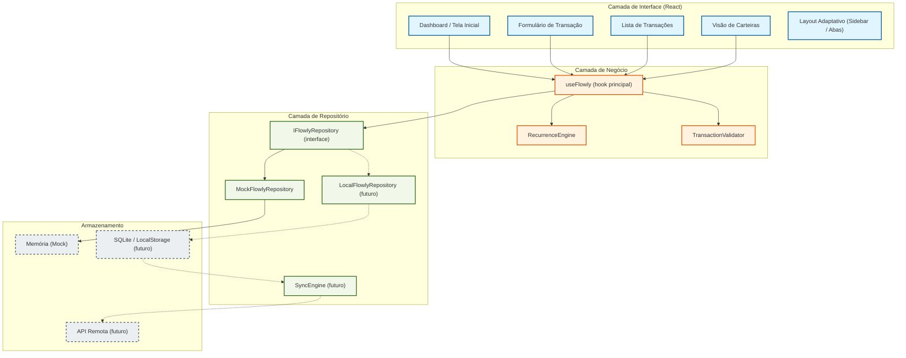

# Documento de Design Técnico — Flowly

## Visão Geral

O Flowly é um aplicativo de gestão financeira multiplataforma construído com React + TypeScript + Vite. O objetivo central é oferecer uma experiência "zero fricção" para adultos de 30 a 70+ anos que desejam controle financeiro sem precisar aprender conceitos técnicos.

O design técnico prioriza três pilares:

1. **Offline-First**: todas as operações funcionam sem internet; a sincronização é transparente e em background.
2. **Repository Pattern com injeção de dependência**: a UI nunca conhece a origem dos dados, permitindo trocar `MockFlowlyRepository` → `LocalFlowlyRepository` → `CloudFlowlySync` sem alterar uma linha de código de interface.
3. **Simplicidade de UX**: ícones com texto, mensagens positivas, navegação adaptativa (sidebar no desktop, abas inferiores no mobile).

A fase atual implementa o `MockFlowlyRepository` com dados em memória, exercitando todos os fluxos de interface sem banco de dados ativo.

---

## Arquitetura

### Diagrama de Camadas



### Fluxo de Dados

```
Ação do Usuário
    → useFlowly (hook)
        → TransactionValidator (valida campos)
        → IFlowlyRepository (operação CRUD)
            → MockFlowlyRepository (fase atual)
                → estado em memória
        → RecurrenceEngine (se transação fixa)
    → Estado React atualizado
    → Re-render da UI com feedback positivo
```

### Decisões de Arquitetura

| Decisão | Escolha | Justificativa |
|---|---|---|
| Gerenciamento de estado | React Context + `useReducer` | Evita dependência externa (Redux/Zustand) na fase atual; suficiente para o escopo |
| Injeção de dependência | React Context para o repositório | Permite trocar implementação sem alterar componentes |
| Validação | Camada separada (`TransactionValidator`) | Reutilizável entre UI e testes; desacoplada do repositório |
| Recorrência | `RecurrenceEngine` isolado | Lógica complexa separada para facilitar testes e evolução |
| Testes | Vitest + fast-check (já no projeto) | fast-check já está instalado; ideal para property-based testing |

---

## Componentes e Interfaces

### Interface do Repositório

```typescript
interface IFlowlyRepository {
  // Transações
  listarTransacoes(filtros?: TransactionFilter): Promise<Transaction[]>;
  adicionarTransacao(transacao: Omit<Transaction, 'id'>): Promise<Transaction>;
  atualizarTransacao(id: string, dados: Partial<Transaction>): Promise<Transaction>;
  removerTransacao(id: string): Promise<void>;

  // Carteiras
  listarCarteiras(): Promise<Wallet[]>;
  adicionarCarteira(nome: string): Promise<Wallet>;
  obterSaldoPorCarteira(nomeCarteira: string): Promise<number>;
}

interface TransactionFilter {
  carteira?: string;
  tipo?: 'entrada' | 'saida';
  dataInicio?: string;
  dataFim?: string;
}
```

### Hook Principal

```typescript
// src/hooks/useFlowly.ts
function useFlowly(): {
  // Estado
  transacoes: Transaction[];
  carteiras: Wallet[];
  carregando: boolean;
  erro: string | null;

  // Ações de transação
  adicionarTransacao(dados: TransactionInput): Promise<void>;
  copiarTransacao(id: string): TransactionInput;
  duplicarTransacao(id: string): Promise<void>;
  moverTransacao(id: string, novaCarteira: string): Promise<void>;
  removerTransacao(id: string): Promise<void>;

  // Ações de carteira
  adicionarCarteira(nome: string): Promise<void>;

  // Utilitários
  obterSaldoTotal(): number;
}
```

### Componentes de Interface

```
src/
├── components/
│   ├── layout/
│   │   ├── AppLayout.tsx          # Decide sidebar vs abas inferiores
│   │   ├── Sidebar.tsx            # Navegação desktop
│   │   └── BottomTabs.tsx         # Navegação mobile
│   ├── transactions/
│   │   ├── TransactionForm.tsx    # Formulário add/editar
│   │   ├── TransactionList.tsx    # Lista com ações de linha
│   │   ├── TransactionItem.tsx    # Item individual com botões
│   │   └── RecurrenceToggle.tsx   # Controle de transação fixa
│   ├── wallets/
│   │   ├── WalletList.tsx         # Lista de carteiras com saldos
│   │   └── WalletCard.tsx         # Card individual de carteira
│   └── shared/
│       ├── ConfirmDialog.tsx      # Diálogo de confirmação (já existe)
│       ├── Toast.tsx              # Mensagens de feedback positivo
│       └── SyncIndicator.tsx      # Indicador de sincronização
├── hooks/
│   ├── useFlowly.ts               # Hook principal
│   └── useMediaQuery.ts           # Detecta desktop vs mobile
├── repository/
│   ├── IFlowlyRepository.ts       # Interface
│   ├── MockFlowlyRepository.ts    # Implementação atual
│   └── RepositoryContext.tsx      # Provider de injeção de dependência
├── engine/
│   ├── TransactionValidator.ts    # Validação de campos
│   └── RecurrenceEngine.ts        # Lógica de transações fixas
└── types/
    └── flowly.ts                  # Tipos centrais
```

### Contexto de Injeção de Dependência

```typescript
// src/repository/RepositoryContext.tsx
const RepositoryContext = createContext<IFlowlyRepository | null>(null);

export function RepositoryProvider({ children }: { children: ReactNode }) {
  // Fase atual: Mock. Futuramente: LocalFlowlyRepository
  const repo = useMemo(() => new MockFlowlyRepository(), []);
  return (
    <RepositoryContext.Provider value={repo}>
      {children}
    </RepositoryContext.Provider>
  );
}

export function useRepository(): IFlowlyRepository {
  const repo = useContext(RepositoryContext);
  if (!repo) throw new Error('useRepository deve ser usado dentro de RepositoryProvider');
  return repo;
}
```

---

## Modelos de Dados

### Transaction

```typescript
interface Transaction {
  id: string;                        // UUID gerado automaticamente
  descricao: string;                 // Texto livre, não vazio
  valor: number;                     // Decimal positivo (> 0)
  tipo: 'entrada' | 'saida';         // Enum restrito
  data: string;                      // ISO 8601: YYYY-MM-DD
  fixo: boolean;                     // Indica recorrência mensal
  carteira_origem: string;           // Nome da carteira associada
  recorrencia_id?: string;           // ID do grupo de recorrência (transações fixas)
  timestamp?: number;                // Unix timestamp para resolução de conflitos
}

type TransactionInput = Omit<Transaction, 'id' | 'timestamp'>;
```

### Wallet

```typescript
interface Wallet {
  nome: string;                      // Identificador único (ex: "Banco do Brasil")
  saldo: number;                     // Calculado: soma entradas - soma saídas
}
```

### Resultado de Validação

```typescript
type ValidationResult =
  | { valido: true }
  | { valido: false; erro: string };
```

### Estado da Aplicação

```typescript
interface FlowlyState {
  transacoes: Transaction[];
  carteiras: Wallet[];
  carregando: boolean;
  erro: string | null;
  sincronizando: boolean;
}
```

### Regras de Validação

| Campo | Regra |
|---|---|
| `descricao` | String não vazia após trim |
| `valor` | Número > 0 |
| `tipo` | Exatamente `"entrada"` ou `"saida"` |
| `data` | Formato `YYYY-MM-DD` válido (regex + Date parse) |
| `carteira_origem` | String não vazia; carteira deve existir |
| `fixo` | Boolean |

