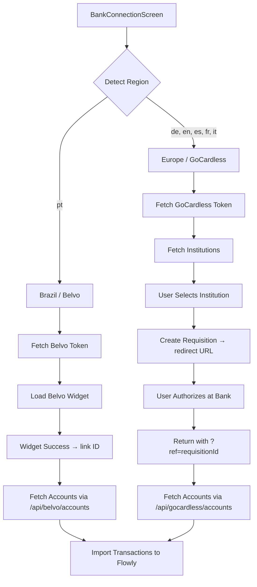

# Design Document: Multi-Region Bank Connection

## Overview

This feature replaces the existing Pluggy integration (R$2,500/month) with two free providers:

- **Belvo** — Brazilian banks via Open Finance Brasil (free up to 25 connections)
- **GoCardless Bank Account Data** — European banks via PSD2 (free tier)

The system detects the user's region from their language preference (`Idioma`) and routes them to the appropriate provider. The user can also manually override the detected region. All provider credentials remain server-side in Vercel serverless functions.



---

## Architecture

The system is split into two layers:

**Client layer** (`src/screens/BankConnectionScreen.tsx`): Handles UI state machine, region detection, widget lifecycle (Belvo), redirect flow (GoCardless), and transaction import orchestration.

**Server layer** (Vercel serverless functions under `api/`): Proxies all third-party API calls, keeping credentials server-side. Each provider has its own subdirectory.

```
api/
  belvo/
    token.ts          ← POST → Belvo auth → returns { access }
    accounts.ts       ← GET ?link= → returns accounts[]
    transactions.ts   ← GET ?link=&account_id=&date_from=&date_to= → returns transactions[]
  gocardless/
    token.ts          ← POST → GoCardless auth → returns { access }
    institutions.ts   ← GET ?country= → returns institutions[]
    requisition.ts    ← POST { institutionId, redirectUrl } → returns { id, link }
    accounts.ts       ← GET ?requisitionId= → returns accountIds[]
    transactions.ts   ← GET ?accountId=&date_from=&date_to= → returns transactions[]
```

---

## Components and Interfaces

### RegionDetector

A pure function that maps `Idioma` to `Region`:

```typescript
type Region = 'brazil' | 'europe';

function detectRegion(idioma: Idioma): Region {
  return idioma === 'pt' ? 'brazil' : 'europe';
}
```

### BankConnectionScreen

Replaces the existing Pluggy-based screen. Manages a state machine with these states:

```typescript
type Etapa =
  | 'inicio'
  | 'selecionandoInstituicao'   // GoCardless only: institution picker
  | 'conectando'                // Belvo: widget open / GoCardless: redirecting
  | 'aguardandoRetorno'         // GoCardless: user returned from bank
  | 'importando'
  | 'concluido'
  | 'erro';
```

On mount, the screen checks the URL for a `ref` query parameter (GoCardless return). If present, it skips to the `aguardandoRetorno` state and begins account/transaction fetching.

### Vercel API Handlers

Each handler follows the same pattern:
1. Validate required parameters → 400 if missing
2. Check env vars → 500 if missing
3. Fetch a fresh access token from the provider
4. Proxy the request to the provider API
5. Return the result or a normalized error

---

## Data Models

### Region

```typescript
type Region = 'brazil' | 'europe';
```

### BelvoAccount

```typescript
interface BelvoAccount {
  id: string;
  name: string;
  institution: { name: string };
  type: string;
  balance: { current: number };
  currency: string;
}
```

### BelvoTransaction

```typescript
interface BelvoTransaction {
  id: string;
  description: string;
  amount: number;
  value_date: string;
  type: 'INFLOW' | 'OUTFLOW';
  account: { id: string };
}
```

### GoCardlessInstitution

```typescript
interface GoCardlessInstitution {
  id: string;
  name: string;
  logo: string;
  countries: string[];
}
```

### GoCardlessRequisition

```typescript
interface GoCardlessRequisition {
  id: string;
  link: string;
  status: string;
  accounts: string[];
}
```

### GoCardlessTransaction

```typescript
interface GoCardlessTransaction {
  transactionId: string;
  bookingDate: string;
  transactionAmount: {
    amount: string;   // e.g. "-42.50" or "1200.00"
    currency: string;
  };
  remittanceInformationUnstructured?: string;
}
```

### Transaction type mapping

| Provider | Raw type | Flowly tipo |
|---|---|---|
| Belvo | `INFLOW` | `entrada` |
| Belvo | `OUTFLOW` | `saida` |
| GoCardless | `amount` positive | `entrada` |
| GoCardless | `amount` negative | `saida` |

### Date range

Transactions are fetched from the first day of the previous calendar month to today:

```typescript
function getDateRange(): { from: string; to: string } {
  const today = new Date();
  const from = new Date(today.getFullYear(), today.getMonth() - 1, 1);
  return {
    from: from.toISOString().split('T')[0],
    to: today.toISOString().split('T')[0],
  };
}
```

---

## Correctness Properties

*A property is a characteristic or behavior that should hold true across all valid executions of a system — essentially, a formal statement about what the system should do. Properties serve as the bridge between human-readable specifications and machine-verifiable correctness guarantees.*

### Property 1: Region detection is a total function over all Idioma values

*For any* valid `Idioma` value, `detectRegion` SHALL return `'brazil'` if and only if the idioma is `'pt'`, and `'europe'` for all other valid idioma values (`'de'`, `'en'`, `'es'`, `'fr'`, `'it'`).

**Validates: Requirements 1.1, 1.2**

### Property 2: Manual region override takes precedence

*For any* auto-detected region and any manually selected region, after the user manually selects a region, the active region used by `BankConnectionScreen` SHALL equal the manually selected region, regardless of the auto-detected value.

**Validates: Requirements 1.4**

### Property 3: API handlers return 400 for any missing required parameter

*For any* request to a Belvo or GoCardless Vercel handler that is missing one or more required query/body parameters, the handler SHALL return HTTP status 400 with a non-empty error message.

**Validates: Requirements 4.3, 4.6, 6.3, 7.3, 8.3, 8.6**

### Property 4: Token proxy returns provider error status unchanged

*For any* non-2xx HTTP status returned by the Belvo or GoCardless authentication API, the corresponding Vercel token handler SHALL return the same HTTP status code to the client.

**Validates: Requirements 2.5, 5.5**

### Property 5: Transaction type mapping is total and correct

*For any* Belvo transaction, the imported Flowly `tipo` SHALL be `'entrada'` if and only if the Belvo transaction type is `'INFLOW'`, and `'saida'` otherwise. *For any* GoCardless booked transaction, the imported Flowly `tipo` SHALL be `'entrada'` if and only if the `transactionAmount.amount` value is positive (≥ 0), and `'saida'` otherwise.

**Validates: Requirements 10.2**

### Property 6: Date range always starts on the first of the previous month

*For any* current date, the computed `from` date used for transaction fetching SHALL be the first calendar day of the month immediately preceding the current month.

**Validates: Requirements 10.3**

### Property 7: URL is cleaned after GoCardless return

*For any* URL containing a `ref` query parameter upon return from GoCardless bank authorization, after `BankConnectionScreen` processes the return, the `ref` parameter SHALL be absent from the browser URL without triggering a full page reload.

**Validates: Requirements 9.5**

---

## Error Handling

| Scenario | Handler behavior | UI behavior |
|---|---|---|
| Missing env vars | Return 500 with message | Show error state, allow retry |
| Provider auth failure | Return provider status + message | Show error state, allow retry |
| Missing query params | Return 400 with message | N/A (client always sends params) |
| Belvo widget error event | N/A | Show error message, return to inicio |
| Belvo widget closed early | N/A | Return to inicio silently |
| GoCardless redirect fails | Return 500 | Show error state, allow retry |
| Transaction import partial failure | Log per-account error | Show error state with count of imported so far |
| Wallet already exists | Catch and ignore | Continue importing transactions |

All Vercel handlers set `Access-Control-Allow-Origin: *` and handle `OPTIONS` preflight requests.

---

## Testing Strategy

### Unit tests (example-based)

- `detectRegion('pt')` returns `'brazil'`
- `detectRegion('de')` returns `'europe'`
- `getDateRange()` returns correct `from`/`to` for a known date
- `BankConnectionScreen` renders region selector
- `BankConnectionScreen` shows Belvo flow when region is `brazil`
- `BankConnectionScreen` shows institution picker when region is `europe`
- `BankConnectionScreen` handles `?ref=` param on mount and cleans URL
- Each Vercel handler returns 400 when required params are missing
- Each Vercel handler returns 500 when env vars are missing

### Property-based tests

Using **fast-check** (already consistent with the project's TypeScript/Vitest stack). Each property test runs a minimum of **100 iterations**.

Tag format: `// Feature: multi-region-bank-connection, Property {N}: {property_text}`

- **Property 1** — Generate all 6 `Idioma` values (and arbitrary strings for robustness), assert `detectRegion` output matches expected region.
- **Property 2** — Generate arbitrary `(autoRegion, manualRegion)` pairs, assert manual selection always wins.
- **Property 3** — Generate requests with random subsets of required params omitted, assert 400 response.
- **Property 4** — Generate non-2xx status codes (400–599), mock provider to return them, assert handler echoes the same status.
- **Property 5** — Generate random Belvo/GoCardless transaction objects, assert type mapping is correct for all inputs.
- **Property 6** — Generate random `Date` values, assert `getDateRange(date).from` equals the first of the previous month.
- **Property 7** — Generate random `requisitionId` strings, assert URL is cleaned after processing.

### Integration tests

- POST to `/api/belvo/token` with valid sandbox credentials returns `{ access }` token
- POST to `/api/gocardless/token` with valid sandbox credentials returns `{ access }` token
- GET to `/api/gocardless/institutions?country=DE` returns a non-empty array
- Full GoCardless redirect flow with sandbox institution (manual/E2E)
